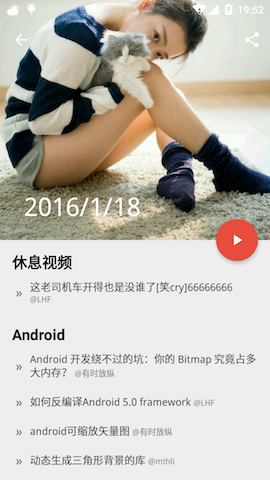
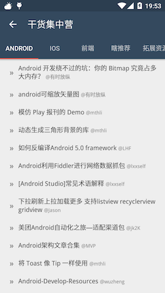

# Gank.io
>gank.io unofficial client - RxJava、Retrofit &amp; MVP

- iOS 版本的客户端请移步[Gank.lu](https://github.com/Panl/Gank.lu)

  

- **下载地址** [fir.im](http://fir.im/Gank)

  

#### 项目介绍：
「Gank.io」是干货集中营的非官方客户端之一，每天提供一张精选的妹纸图片，一个精选的休息视频，若干精选的Android，ios，web等相关的技术干货。主页采取了突出妹纸的卡片设计，点击图片可查看大图，点击卡片下的文字可进入每日干货，右下角的『fab』可进入纯干货页面，可根据分类浏览。  

本项目完全开源，由Panl完成，是学习RxJava，Retrofit等优秀开源框架以及MVP设计模式的产物，项目借鉴了[**drakeet**](https://github.com/drakeet)的开源项目[**Meizhi**](https://github.com/drakeet/Meizhi)以及[**maoruibin**](https://github.com/maoruibin)的开源项目[**GankDaily**](https://github.com/maoruibin/GankDaily)，收获很多，感谢开源社区。由于水平有限，项目中难免有所纰漏，如果有问题请与我联系 panlei106@gmail.com  

数据来源: [**daimajia**](https://github.com/daimajia)的干货集中营 [http://gank.io/api](http://gank.io/api)

### 特别感谢：
- [**drakeet/Meizhi**](https://github.com/drakeet/Meizhi)
- [**maoruibin/GankDaily**](https://github.com/maoruibin/GankDaily)
- [**代码家/干货集中营api**](http://gank.io/api)

### License

    /*
     *       
     * Copyright (C) 2015 Drakeet <drakeet.me@gmail.com>
     * Copyright (C) 2015 GuDong <maoruibin9035@gmail.com>
     * Copyright (C) 2016 Panl <panlei106@gmail.com>
     *
     * Meizhi is free software: you can redistribute it and/or modify
     * it under the terms of the GNU General Public License as published by
     * the Free Software Foundation, either version 3 of the License, or
     * (at your option) any later version.
     *
     * Meizhi is distributed in the hope that it will be useful,
     * but WITHOUT ANY WARRANTY; without even the implied warranty of
     * MERCHANTABILITY or FITNESS FOR A PARTICULAR PURPOSE.  See the
     * GNU General Public License for more details.
     *
     * You should have received a copy of the GNU General Public License
     * along with Meizhi.  If not, see <http://www.gnu.org/licenses/>.
     */
